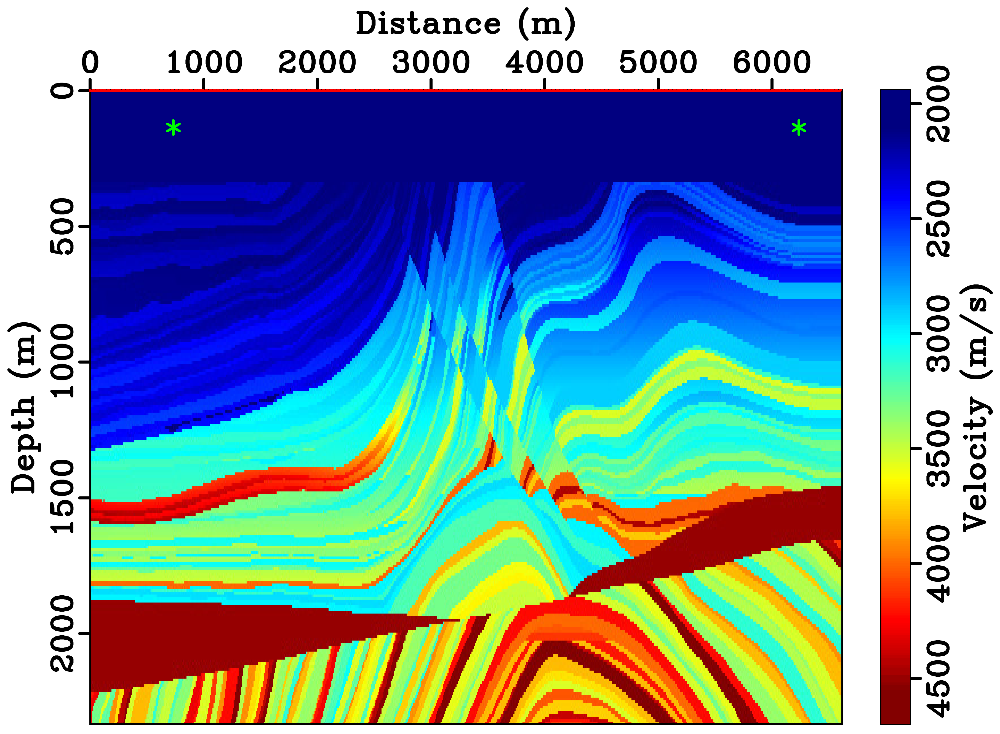
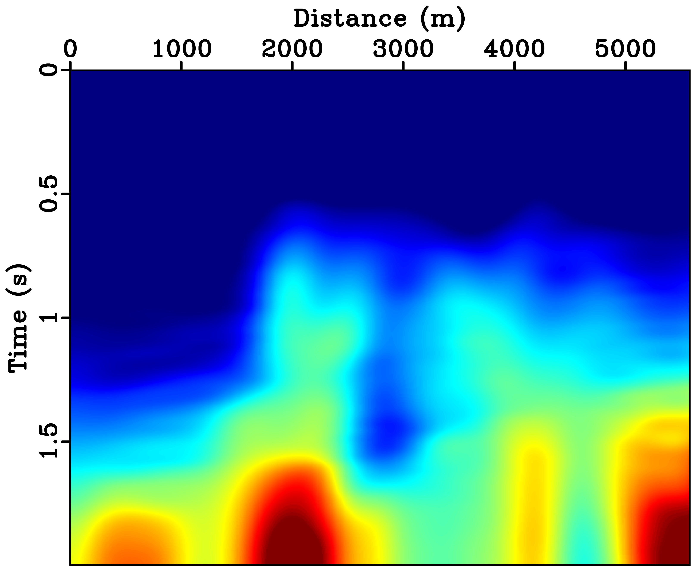
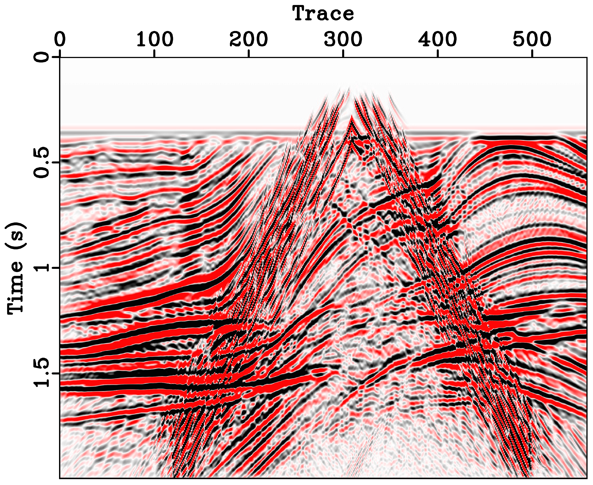
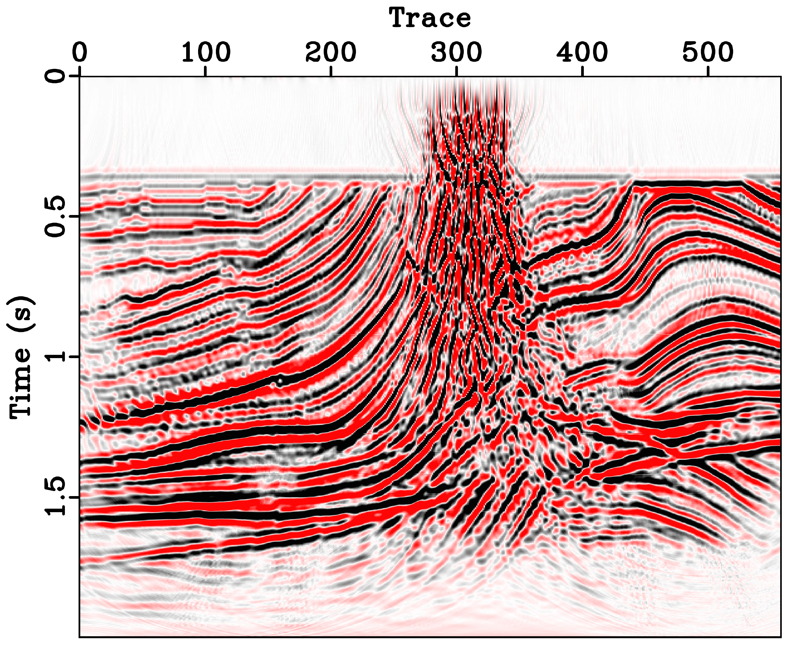

# Training Deblending Networks with Blended Data Inversion

This repository contains the source code, processing scripts, and deep learning models for the research paper: **"Training Deblending Networks with Datasets Derived from Blended Data Inversion and Controlled Blending Parameters"**.

---

## 1. Label Generation via Direct Imaging

This section covers the workflow for generating high-quality training labels using seismic inversion and imaging techniques.

### Prerequisites & Environment
* **OS:** Ubuntu 20.04/22.04
* **GPU:** CUDA 11.4 (or compatible)
* **MPI:** MPICH-3.3.2
* **Seismic Software:** [Madagascar](https://ahay.org/wiki/Main_Page) (RSF)

### Workflow Steps
1.  **Forward Modeling:** * Navigate to the `Forward/` directory.
    * Run `make obs` to generate synthetic seismic records.
    * The pre-generated results are stored in `/forward_output/`. 
    * *Note: To use custom velocity models, please refer to the README in the folder for parameter settings.*
    

2.  **Seismic Processing & Blending:**
    * `process/`: Contains the workflow for standard single-source seismic processing.
    * `blend_and_process/`: Handles multi-source (blended) data generation and direct imaging. 
    
    
    
    * **Execution:** Run `scons` in these directories to automatically load parameters and execute the full processing chain.

    
3.  **Label Preparation (`re_forward/`):**
    * The `input/` folder contains `other1.dat` (direct inversion modeling data) and time-to-depth conversion codes. 
    * Run `make obs` to generate seismic records from velocity models derived via direct imaging. These records serve as the **ground truth labels** for deep learning.

---

## 2. Deblending (Deep Learning Architectures)

We provide two distinct network implementations for the deblending task.

### A. CNN-based Deblending (`deblending/CNN/`)
1.  **Data Preparation:** Enter `Data_marmousi/` and run `scons` to generate the training dataset.
2.  **Training:** Navigate to `training_marmousi/` and execute:
    ```bash
    python train.py --model=3
    ```
3.  **Testing:** Navigate to `test_marmousi/` and execute:
    ```bash
    python ztest.py --model=3
    ```

### B. CDUTnet Architecture (`deblending/CDUTnet/`)
1.  **Data Preparation:** Enter the `data/` folder and run `set_train_data.py` to preprocess training samples.
2.  **Training:** Execute the following command to start training with the provided configuration:
    ```bash
    python main_training.py --cfg ./configs/CDUTnet.yaml --batch-size=16
    ```
3.  **Inference:** After training, run the following to test on Common Receiver Gathers (CRG):
    ```bash
    python main_crg.py --cfg ./configs/CDUTnet.yaml
    ```

---


---

## 4. Citation

<!-- If you find this code or research helpful, please cite:
> Li, Z., & Zu, S. (2026). Training Deblending Networks with Datasets Derived from Blended Data Inversion and Controlled Blending Parameters. *Computers & Geosciences*. -->